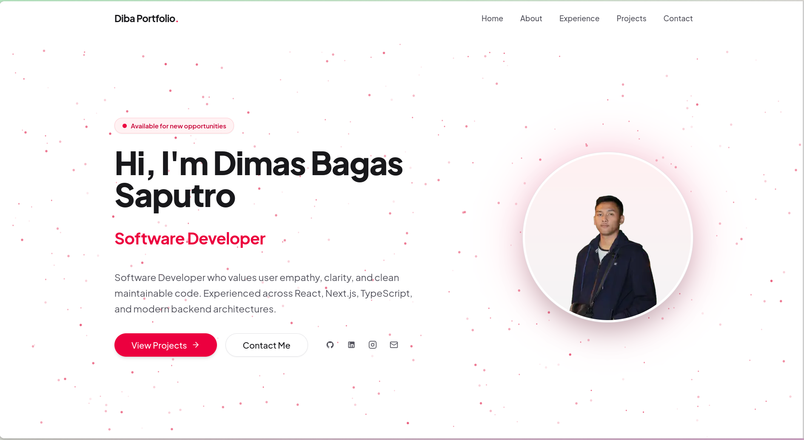

# Dimas Bagas Saputro — Personal Portfolio

Modern, responsive, and performance-focused developer portfolio built with Next.js 16 (App Router), React 19,
TypeScript, and Tailwind CSS v4.



---

## Overview

This repository contains the personal portfolio website of **Dimas Bagas Saputro (Diba)**, an Informatics graduate and
Software Developer with full-stack capabilities. The project showcases authentic engineering projects, verified
certifications, academic background, and technical philosophy with a strong focus on clean code, accessible UI design,
and responsive mobile-first performance.

- **Live URL**: [diba-portfolio-2026.vercel.app](https://diba-portfolio-2026.vercel.app/)
- **Primary Domain**: Frontend & Software Engineering

---

## Tech Stack

| Category                      | Technology                              | Purpose                                                                 |
|:------------------------------|:----------------------------------------|:------------------------------------------------------------------------|
| **Framework**                 | Next.js 16 (App Router)                 | Server-driven rendering, static generation (SSG), and Turbopack bundler |
| **UI Library**                | React 19                                | Modern React component architecture                                     |
| **Language**                  | TypeScript                              | Strict type safety and data contract enforcement                        |
| **Styling**                   | Tailwind CSS v4                         | High-performance atomic utility styling with modern CSS engine          |
| **Runtime & Package Manager** | Bun                                     | Fast package installation, execution, and local build pipeline          |
| **Code Quality & Linter**     | Biome                                   | Strict linting and formatting with zero-bypass standard                 |
| **Animations & Effects**      | Motion (Framer Motion) & Rough Notation | Smooth transitions, in-view fades, and Magic UI hand-drawn highlighter  |
| **State Management**          | Zustand & TanStack Query                | Client UI state management paired with server cache separation          |
| **Icons**                     | Lucide React & Custom SVG Assets        | Lightweight, tree-shaken UI and brand social icons                      |

---

## Key Features

- **Mobile-First Responsive Design**: Optimized across mobile (360px+), tablet, and desktop viewports with fluid
  spacing, adaptive touch targets, and balanced element ordering.
- **Dynamic Scroll Navbar**: Seamless backdrop transition that stays transparent within the hero section and adopts a
  frosted glass blur effect (`backdrop-blur-md`) upon scrolling.
- **Interactive Bento Grid**: Highlighting core competencies, education, and credentials using a safe flexbox header
  flow with no mobile layout collisions.
- **Magic UI Text Highlighter**: Hand-drawn marker strokes and annotations powered by `rough-notation` triggered
  dynamically as visitors scroll into view.
- **Project Showcase & Slug Routing**: Dynamic routing for featured applications (`/projects/[slug]`) complete with
  media carousels, problem breakdowns, and architecture highlights.
- **Decoupled Icon Assets**: Centralized SVG icon module (`@/assets/icons`) eliminating redundant inline SVG definitions
  across components.
- **Single Source of Truth**: Data contracts structured within `src/types/` and `src/data/`, mirroring production
  MongoDB document schemas for seamless future backend integration.

---

## Project Structure

```text
portfolio-2026/
├── public/                 # Static assets, favicon, preview banner, project images
│   ├── preview.png         # Main repository preview banner (16:9 ratio)
│   └── projects/           # Screenshots and assets for portfolio projects
├── src/
│   ├── app/                # Next.js App Router (pages, layout, routes)
│   │   ├── about/          # Dedicated biography, education, and skills page
│   │   ├── projects/[slug] # Dynamic project case-study detail pages
│   │   ├── layout.tsx      # Root layout, fonts, and global metadata
│   │   └── page.tsx        # Single-page overview (Hero, About, Projects, Contact)
│   ├── assets/
│   │   └── icons/          # Reusable SVG icon components (GithubIcon, LinkedinIcon, etc.)
│   ├── components/
│   │   ├── base/           # Core layout components (Navbar, Footer)
│   │   ├── sections/       # Modular home page sections (Hero, About, Projects, Contact)
│   │   └── ui/             # Reusable primitives (Buttons, Cards, Highlighter, BentoGrid)
│   ├── data/               # Master data sources (profileData, experienceData, aboutData)
│   ├── hooks/              # Custom React hooks (useMounted, mobile queries)
│   ├── lib/                # Utility functions and class merging helpers (cn)
│   └── types/              # Strict TypeScript interfaces and data schemas
├── biome.json              # Biome linter and formatter configuration
├── next.config.ts          # Next.js configuration
├── package.json            # Project dependencies and operational scripts
├── tsconfig.json           # Strict TypeScript configuration
└── README.md               # Repository documentation
```

---

## Author & Contact

**Dimas Bagas Saputro (Diba)**  
Software Developer — Karawang, West Java, Indonesia

- **Email**: [dimaabagas73@proton.me](mailto:dimaabagas73@proton.me)
- **LinkedIn**: [linkedin.com/in/dimasbagassaputro](https://linkedin.com/in/dimasbagassaputro)
- **GitHub**: [github.com/Diba15](https://github.com/Diba15)
